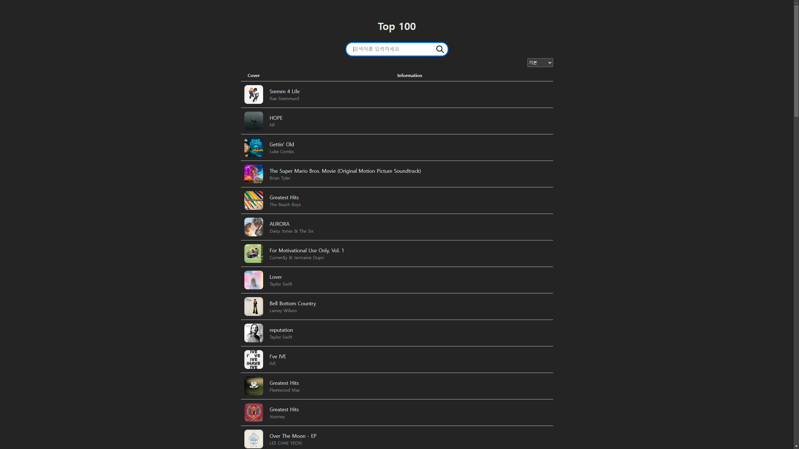
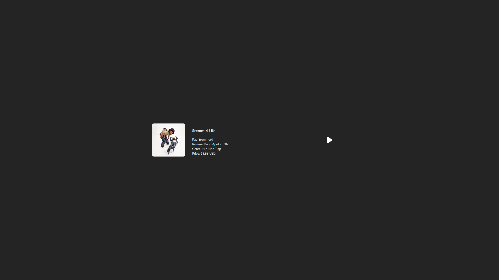
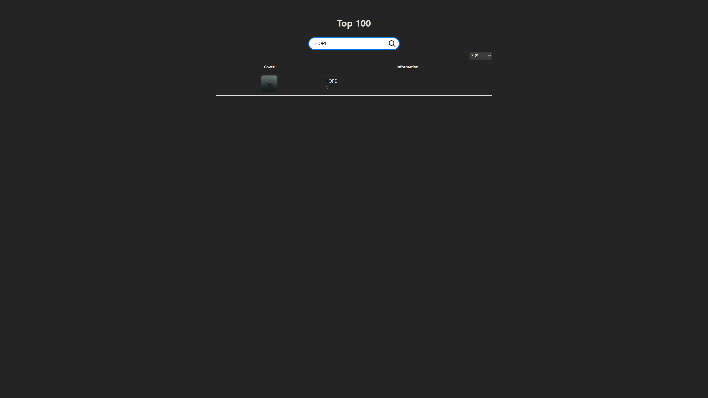

# Elmusic Top100 Chart

## Installation

1. https://github.com/kyma-dev/elmusic.git
2. cd elmusic
3. yarn install
4. yarn build && yarn preview
5. go to http://localhost:4173/

## Description

- 아이튠즈 TOP 100 Album API를 이용한 Elmusic 서비스의 TOP 100 Chart 페이지 & 앨범 상세 페이지 구현

## Feature

- 앨범 이름 검색 (현재 검색 버튼만을 통해 작동 가능)
- 앨범 이름 기준 오름차순, 내림차순 정렬
- 앨범 이미지 클릭 시 각 상세페이지 이동

### Top 100 Album Chart Page

### Album Detailed Page

### Search Album

##### Developed by 최한울
